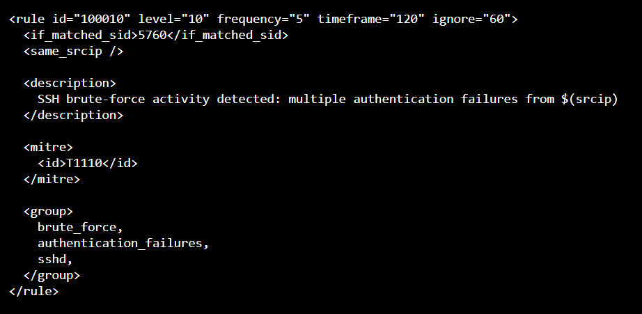
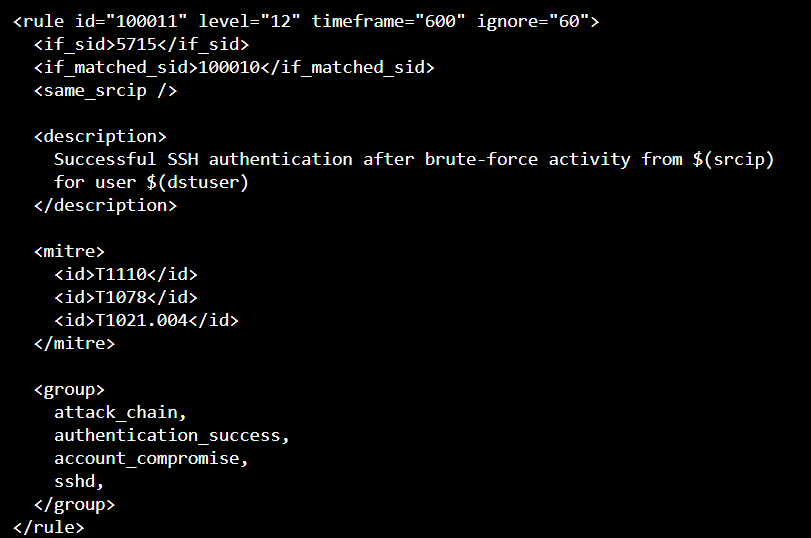
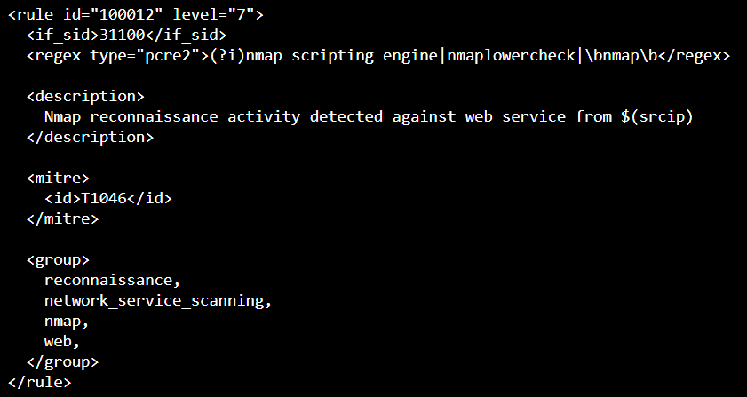
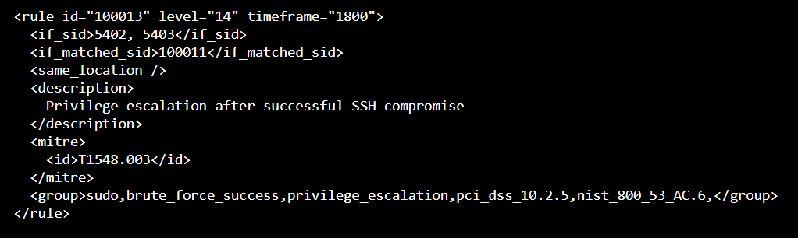

# Detection Rules

## Overview

Custom Wazuh rules were developed to detect the attack behaviors generated during the controlled security simulations.

The rules were designed to detect individual events and correlate multiple events into a higher-level attack sequence.

---

## Custom Rule Set

| Rule ID | Detection                         | Source          | Level |
| ------- | --------------------------------- | --------------- | ----: |
| 100010  | SSH brute-force activity          | SSH / sshd      |    10 |
| 100011  | Successful SSH compromise         | SSH / sshd      |    12 |
| 100012  | Port scanning / Nmap activity     | Web log         |     7 |
| 100013  | Privilege escalation through sudo | sudo            |    13 |

The project-specific rules use the `100000–119999` range to separate them from the default Wazuh rule set.

---

## Rule 100010 — SSH Brute Force

**Purpose:** Detect repeated SSH authentication failures indicating potential brute-force activity.

```text
Multiple failed SSH authentication attempts
                    ↓
          Brute-force detection
                    ↓
              Level 10 alert
```

The rule is designed to identify abnormal authentication activity rather than relying on a single failed login.

---


## Rule 100011 — Successful SSH Compromise

**Purpose:** Detect a successful SSH login following repeated failed authentication attempts.

```text
Failed SSH attempts
        +
Successful SSH login
        ↓
Potential successful brute-force
        ↓
Level 12 alert
```

This correlation increases the significance of the successful authentication event.

---


## Rule 100012 — Port Scanning

**Purpose:** Detect reconnaissance activity associated with port scanning and Nmap scripting activity.

```text
Scanning / Nmap activity
          ↓
Reconnaissance detection
          ↓
Level 7 alert
```

This rule provides visibility into the reconnaissance stage before authentication attacks occur.

---


## Rule 100013 — Privilege Escalation

**Purpose:** Detect suspicious privilege escalation activity through `sudo`.

```text
Suspicious sudo activity
          ↓
Privilege escalation detection
          ↓
Level 13 alert
```

The higher severity reflects the potential impact of successful privilege escalation.

---

## Detection Logic

The detection workflow can be summarized as:

```text
Raw Log
   ↓
Wazuh Decoder
   ↓
Custom Detection Rule
   ↓
Rule Matching
   ↓
Correlation
   ↓
Alert Severity
   ↓
Dashboard Investigation
```

---

## Rule Tuning

Rule tuning was performed by comparing:

* Generated attack events
* Wazuh raw logs
* Detection alerts
* Expected attack behavior
* Alert severity
* False positive events

The goal was to maintain sufficient sensitivity for the simulated attacks while minimizing unnecessary alerts.

---

## Detection Result

The five defined attack behaviors in the benchmark were successfully detected.

```text
Expected detections: 5
Detected:            5

Detection Rate:      100%
```

The result applies to the controlled scenarios implemented in this laboratory and does not represent universal detection coverage for real-world attacks.
