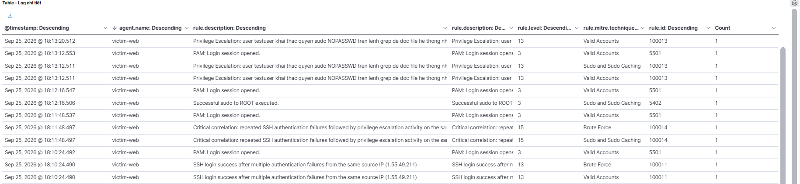
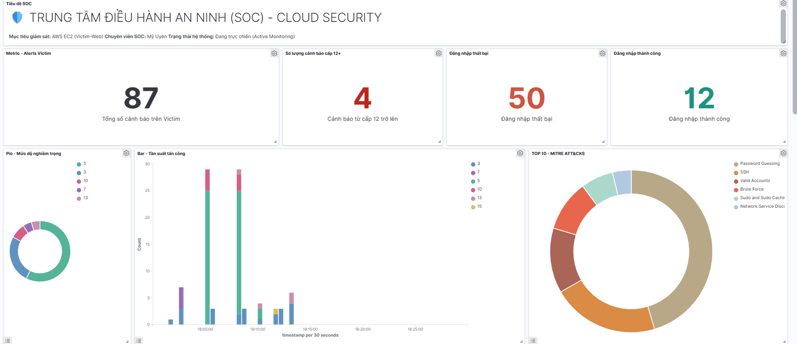

# Performance Evaluation

## Overview

The Wazuh monitoring environment was evaluated using controlled attack scenarios.

Three metrics were used:

* Detection Rate
* Alert Latency
* False Positive Rate

---

## 1. Detection Rate

Detection Rate measures how many of the expected attack behaviors were successfully detected.

```text
Detection Rate = True Positives / Total Actual Attacks × 100
```

For the tested attack sequence:

```text
Expected attack behaviors: 5
Successfully detected:     5

Detection Rate = 5 / 5 × 100
               = 100%
```

### Result

**Detection Rate: 100%**

The result is limited to the five attack behaviors implemented and tested in this laboratory.

---

## 2. Alert Latency

Alert latency measures the time between the simulated attack event and the corresponding Wazuh alert.

### Test Results

| Test                 | Attack Time | Alert Time |   Latency |
| -------------------- | ----------- | ---------- | --------: |
| SSH Brute Force #1   | 18:05:06    | 18:05:10   | 4 seconds |
| SSH Brute Force #2   | 18:08:17    | 18:08:22   | 5 seconds |
| SSH Successful Login | 18:10:23    | 18:10:24   |  1 second |



### Average

```text
Average latency
= (4 + 5 + 1) / 3
= 3.33 seconds
```

**Average Alert Latency: 3.33 seconds**

---

## 3. False Positive Rate

False Positive Rate was calculated using:

```text
FPR = FP / (TP + FP) × 100
```

During the benchmark:

```text
Total alerts:     108
False positives:  1
```

The observed false positive was associated with a legitimate AWS CloudTrail `ConsoleLogin` event.

### Result

**False Positive Rate: 0.93%**

---

## 4. Overall Results

| Metric                |       Result |
| --------------------- | -----------: |
| Detection Rate        |         100% |
| Average Alert Latency | 3.33 seconds |
| False Positive Rate   |        0.93% |



---

## 5. Interpretation

The benchmark demonstrated that the implemented Wazuh rules were able to detect all defined attack behaviors in the controlled test scenarios.

The average alert latency of 3.33 seconds indicates that the monitoring pipeline was able to generate alerts shortly after the tested events occurred.

The observed false positive rate was 0.93%, with one legitimate CloudTrail event identified as a false positive during the benchmark.

These measurements describe the performance of the tested laboratory environment and should not be interpreted as production-wide performance guarantees.

---

## 6. Evidence

The project evidence includes:

* Wazuh Dashboard
* Security alerts
* Custom detection rules
* Attack simulation results
* CloudTrail events
* Authentication logs
* Performance measurements

Screenshots can be stored in the project's `screenshots/` directory and referenced from this documentation.
